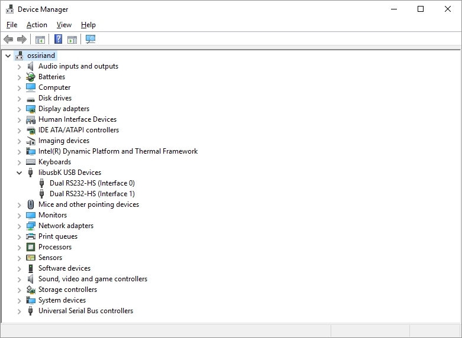

# Install Instructions

We require Yosys, NextPNR, and the IceStorm tools for the workshop.

There are also some optional tools which can be installed if you desire, instructions are below.

It is highly recommended to use Linux or Mac for the workshop, as there are a few quirks with the toolchain and FTDI drivers on Windows. We have included install instructions and potential workarounds for the issues, however cannot guarantee it will function smoothly.

**NOTE:** Unlike previously written, due to driver issues Windows Subsystem for Linux is **NOT** an option for running the environment. Whilst you will be able to build the required files, WSL is unable to communicate with the FTDI programmer we are using and therefore you will not be able to program your FPGA.

## Linux and Mac Installation

Installation instructions for Linux and Mac be found [here](http://www.clifford.at/icestorm/#install).

**NOTE:** The install instructions are missing ```libeigen3-dev``` as a dependency, make sure to ```sudo apt install libeigen3-dev``` before building the FPGA toolchain.

## Windows Installation

Thanks to Wayne for the Windows instructions.

_If you would prefer to use the Lattice Diamond Programmer rather than IceStorm, skip these instructions and go down below._

To install the IceStorm toolchain on a Windows machine:

- Download the IceStorm Toolchain for Windows (which contains the Synthesis Tools) from: https://github.com/im-tomu/fomu.im/releases/download/td19/yosys-icestorm-nextpnr-win64.0.1.zip
- Unzip the contents to a temporary folder, for example: `C:\temp\yosys-icestorm-nextpnr-win64.0.1`
- Copy the `yosys-icestorm-nextpnr-win64.0.1` to `C:\` but rename it to something simple like `fpga-toolchain`, so the path becomes `C:\fpga-toolchain`. Inside your folder will be two subfolders, `bin` and `share`
- Set an environment variable so that the toolchain commands can be run from a Command Prompt:
  - Search Windows: `env`
  - Select: `Edit the system environment variables`
  - Click: `Environment Variables`
  - Scroll to `Path` in the System variables pane and double click to select.
  - Add a new path at the bottom: `C:\fpga-toolchain\bin`
  - Save all dialogs.
- Open a Command Prompt.
- Test by trying: `iceprog --help`

`iceprog` will output it's help. You are good to progress.

Now insert your iCE-feather board via USB into a **USB2 port**. This is important. The following instructions will only work on a USB2 port for now. USB3 support is still being investigated.

Once your iCE-feather is inserted, it will show up in the Device Manager under the `Universal Serial Bus controller` node as two entries:

* USB Serial Converter A
* USB Serial Converter B

If you use other FPGA boards, Lattice tools or Arduino, it is likely that you already have FTDI drivers on your system.

You will need to change this driver used by the FTDI USB to Serial chip used to program the iCE40-feather.

The driver will need to be replaced with `libusbK`. The [Zadig](https://zadig.akeo.ie/) tool will help us do this. Download Zadig and load it up.


iCE-feather will be identified as two instances of `Dual RS232-HS` Interfaces `0` and `1`.

Zadig will show the current driver attached to the device. Here you can change the driver on both interfaces to `libusbK`.

Once done you can exit Zadig.

To confirm that the interfaces are now under `libusbK`, go back to the Device Manager and refresh:



To test that `iceprog` will be able to communicate with the iCE-feather:

`iceprog -t`

This will test the board by reading the flash ID sequence on the board.

You should get the following:

```
c:\Work\iCE40-feather\gateware\blink>iceprog -t
init..
cdone: high
reset..
cdone: low
flash ID: 0xEF 0x40 0x16 0x00
cdone: high
Bye.
```

Now you are ready to program your iCE-feather with blinky, e.g.:

`iceprog blink.bin`

```
c:\Work\iCE40-feather\gateware\blink>iceprog blink.bin
init..
cdone: high
reset..
cdone: low
flash ID: 0xEF 0x40 0x16 0x00
file size: 104090
erase 64kB sector at 0x000000..
erase 64kB sector at 0x010000..
programming..
reading..
VERIFY OK
cdone: high
Bye.
```

Good work!

### Troubleshooting

If you receive:

```
init..
Can't find iCE FTDI USB device (device string i:0x0403:0x6010).
ABORT.
```
1. Ensure you did not plug into a USB3 port. Use a USB2 port.
1. Ensure replaced your driver with the libusbK driver for this device using Zadig.
3. Ensure your microUSB cable is not missing data lines.
4. Check for more suggestions on [this issue](https://github.com/cliffordwolf/icestorm/issues/141) from IceStorm.


## Lattice Diamond programmer for Windows

If you find the open source IceStorm tools a little too difficult, you can opt to install the [Diamond Programmer from Lattice](http://www.latticesemi.com/view_document?document_id=52187) instead.

Warning though, you need to register for it and that takes a number of days.

Also, you need the [FTDI Virtual COM Port Drivers installed](https://www.ftdichip.com/Drivers/VCP.htm) and **NOT** the libusbK driver as described in the IceStorm option.

Connect your iCE-feather board via a USB2 port (not USB3). Important!

Load the Diamond Programmer.

If you see on the dialogue:

```
HW-USBN-2B / FTUSB-0
```

That is a good sign. It means Diamond can see your iCE-feather board.

Proceed in and you will receive:

```
Lattice VM Drivers detected (HW-DLN-3C (Parallel), HW-USBN-2B (FTDI))
Programmer device database loaded
INFO - Scanning USB2 Port FTUSB-0...
ERROR - Failed to scan board.
ERROR - Scan Failed - Creating Blank Programmer Project.
```

Don't be concerned about the `Scan Failed` message. This is because the current Diamond project has not yet been configured for the iCE-feather.

Change the settings to be:
```
Device Family: 	iCE40 UltraPlus
Device:			iCE40UP5K

Operation or Device Properties
------------------------------
Access Mode:  SPI Flash Programming
Operation:	SPI Flash Erase, Program, Verify
Family:	   SPI Serial Flash
Vendor:   	Winbond
Device:	   W25X32
Package:	  8-pin WSON
```

Select your blink.bin and click the `Program` button. Diamond will program the board.

You're all good to go!

Sources used for this article:
*	https://gojimmypi.blogspot.com/2018/05/FPGA-Programming-iCE40UP5K-B-EVN.html
*	https://learn.adafruit.com/adafruit-ft232h-breakout/windows-setup
*	https://github.com/cliffordwolf/icestorm/issues/141
*	https://github.com/joshajohnson/iCE40-feather/blob/master/hardware/iCE40-fpga/bom/ibom.html


## Optional Software Installation

I would also recommend installing [Icarus Verilog](https://iverilog.fandom.com/wiki/Installation_Guide) and [GTKwave](http://gtkwave.sourceforge.net/) for simulation, however this is not required for the WTFpga workshop.

For text editing I personally use Sublime Text with [SublimeLinter](https://packagecontrol.io/packages/SublimeLinter-contrib-iverilog) to help find my bugs, however I'm sure other options exist for your prefered text editor.
